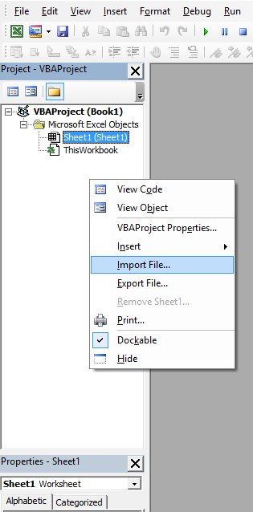
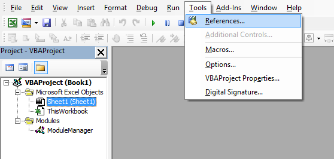
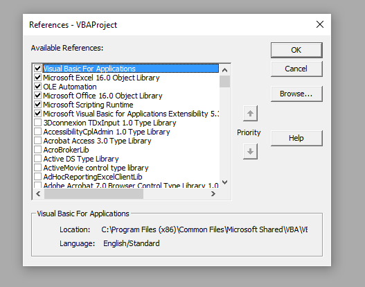

# Module Manager
The Module Manager handles automatic importing and exporting of Excel class, form, and VB modules.  Basically, the Manager imports modules (*.bas, *.frm, *.frx, and *.cls files) from specified directories when the workbook is opened, re-exports them to specified directories when the workbook is saved, and removes them when the workbook is closed.

## Benefits
* Storing code as text allows macros to be edited in the IDE of your choice, like Visual Studio or Notepad++.  All changes will be imported the next time you open the workbook!
* Storing code as text (rather than inside a binary workbook file) allows change tracking with VCS software like Git or SVN.
* Storing code in files separate from the main workbook eases collaboration on multiple macros within the same workbook, and allows for more logically distinct commits.
* By removing modules when the workbook is closed, the Manager reduces the size of the workbook and prevents duplication of code between the text files and the workbook itself.

## Setup
ModuleManager works with Excel 2007 and later (not tested in 2003 or earlier).  The following screenshots show the setup for Excel 2016 on a Windows 10 machine.

1. __Import the ModuleManager module__ file into your workbook(s).  Within the VB Editor (VBE), in the Project Explorer view, right click anywhere under the name of your workbook and select "Import file...".  Select the ModuleManager.bas file that you just downloaded and click "Open".  (Note, normal module management does not apply to the ModuleManager itself, i.e. it will always be present in the workbook and will not be re-imported, exported, or removed).  
  


2. __Add necessary references.__  Within the VBE, select "Tools > References".  In the dialog box, make sure that the following references are selected (if any references are already selected, then you should probably leave those too!):
 * Visual Basic For Applications
 * Microsoft Excel x.x Object Library
 * OLE Automation
 * Microsoft Office x.x Object Library
 * Microsoft Scripting Runtime
 * Microsoft Visual Basic for Applications Extensibility x.x  
  
  
  


3. __Enable developer macro settings.__  In Excel, click "File > Options > Trust Center > Trust Center Settings...".  In the dialog box, select "Macro Settings", then check "Enable all macros" (or "Disable all macros except digitally signed macros" if you know what you're doing), __and__ "Trust access to the VBA project object model".  
  
  
  


4. __Paste the following code__ into the "ThisWorkbook" module of your workbook.  This is the code that actually handles the Workbook Open, Save, and Close events.  Without it, ModuleManager would just take up space!  The comments provide further instructions on customization of the ModuleManager.
```
Option Explicit

Private Sub Workbook_Open()
	'Use the correct path here to a directory with VBA code files.
	'You can add additional ImportMacros() statements to import from multiple locations.
	'The boolean argument specifies whether or not to show a Message Box on completion.
    Call ImportModules(ThisWorkbook.Path, True)
End Sub

Private Sub Workbook_BeforeSave(ByVal SaveAsUI As Boolean, ByRef Cancel As Boolean)
	'Use the correct path here to a directory where you want to export modules.
	'You can add additional ExportMacros() statements to export to multiple locations.
	'Remove this statement if, for example, the workbook is in release mode,
	'and you don't want to confuse the user by creating a bunch of mysterious code files!
    Call ExportModules(ThisWorkbook.Path)
End Sub

Private Sub Workbook_BeforeClose(ByRef Cancel As Boolean)
	'Remove this statement if, for example, the workbook is in release mode,
	'and you don't want to confuse the user by removing all the workbook's functionality!
	'The boolean argument specifies whether or not to show a Message Box on completion.
    Call RemoveModules(True)
End Sub
```
